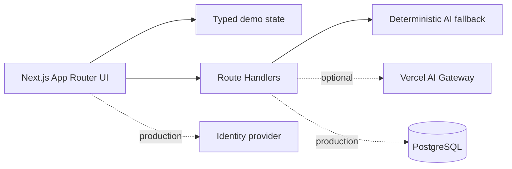

# Alkebulan Flow

**AI Operations Hub for Service Businesses**

Alkebulan Flow is a portfolio-grade operations workspace for small agencies, contractors, consultants, and freelancers. It brings clients, projects, tasks, files, deadlines, activity, and AI-assisted updates into one calm dashboard.

## Current status

Stages 1–2 and the credential-free Stage 3–4 portfolio demo are complete and verified locally. Production persistence and third-party identity remain deliberately pending so the demo runs without credentials while clearly distinguishing prototype behavior from production security.

## Quick start

```bash
npm install
npm run dev
```

Open `http://localhost:3000`. The dashboard opens directly for frictionless portfolio review. Visit `/login` to view the demo authentication and password-reset experience.

```text
Demo workspace: demo@alkebulan.local
Demo password:  FlowDemo2026!
```

These are fictional local-only demo credentials, not contact information or production secrets.

## Architecture



- Next.js 16 App Router, React 19, TypeScript
- Tailwind CSS 4 with owned shadcn-style primitives and Radix foundations
- Recharts for responsive analytics
- Zod contracts for structured AI output
- Vercel AI SDK installed for the credential-backed integration stage
- Vitest for deterministic logic tests

## Roadmap and progress ledger

Checkboxes are marked complete only after implementation and verification.

### 1. Scope and foundation

- [x] Select a credential-free, locally runnable portfolio architecture
- [x] Initialize Next.js, TypeScript, Tailwind, Git, and dependency lockfile
- [x] Establish Alkebulan visual tokens and product positioning
- [x] Create the authoritative README roadmap
- [x] Commit the initial staged history

### 2. Design system and demo experience

- [x] Responsive navigation shell with mobile drawer
- [x] Dashboard information architecture and branded workspace chrome
- [x] Reusable Button, Card, Badge, Input, and avatar patterns
- [x] Accessible labels, focus states, and semantic navigation
- [x] Contact-free demo mode indicator and fictional account
- [x] Verify representative desktop and mobile layouts in a browser

### 3. Data, authentication, and core workflows

- [x] Typed client, project, task, activity, priority, status, and role models
- [x] Seeded demo clients, projects, tasks, and activity
- [x] Login and password-reset demonstration screens
- [x] Owner/Admin/Team role concept represented in the experience
- [x] Client portfolio and project progress views
- [x] Interactive Kanban board with cross-column task movement
- [x] New-task workflow with validation
- [ ] Persistent PostgreSQL/Supabase data adapter
- [ ] Production sign-up, sign-in, secure sessions, and password reset
- [ ] Enforced server-side role permissions
- [ ] Persistent client/project CRUD route handlers

### 4. Operations and AI

- [x] KPI cards, project-health signals, and responsive revenue chart
- [x] Deadline visibility and unified activity feed
- [x] File library and local file-picker interaction
- [x] Notification popover and attention signals
- [x] Structured AI project brief contract
- [x] Project summaries, risks, next actions, and client-update drafting
- [x] Deterministic no-key AI fallback served from a route handler
- [ ] Optional credential-backed AI Gateway generation
- [ ] Durable object/file storage with size and type enforcement
- [ ] Persistent notification state

### 5. Quality and release confidence

- [x] Lint clean
- [x] Typecheck clean
- [x] Unit tests passing
- [x] Production build passing
- [x] Browser smoke test: dashboard, views, task creation, Kanban, AI brief
- [x] Responsive verification at mobile and desktop widths
- [ ] Automated accessibility scan and keyboard-flow review
- [ ] Security review for auth, uploads, authorization, and AI inputs

### 6. Portfolio and deployment package

- [ ] Contact-free polished screenshots
- [x] Short walkthrough script and recording plan
- [x] Architecture diagram
- [x] Setup, test, and implementation documentation
- [x] Environment-variable template
- [x] Vercel deployment instructions and production data checklist
- [ ] Live deployment (requires explicit authorization)

### Stretch features

- [ ] Real-time collaboration
- [ ] Stripe subscriptions
- [ ] Email delivery
- [ ] PDF/CSV export
- [ ] Audit log
- [ ] Dark mode

## Commands

| Command | Purpose |
|---|---|
| `npm run dev` | Start the development server |
| `npm run lint` | Run ESLint |
| `npm run typecheck` | Run TypeScript without emitting files |
| `npm test` | Run deterministic unit tests |
| `npm run build` | Create a production build |

## Latest verification — 2026-09-13

- `npm run lint` — passed with 0 errors and 0 warnings
- `npm run typecheck` — passed
- `npm test` — 1 file, 3 tests passed
- `npm run build` — passed; `/`, `/login`, and `/api/ai/brief` generated successfully
- Browser — desktop dashboard and 390×844 mobile layout rendered without console warnings/errors
- End-to-end — created a task, observed the task count update, called `POST /api/ai/brief`, and rendered summary, risks, next actions, and client update
- Git — initial verified MVP checkpoint created as `172922b`

## AI behavior

`POST /api/ai/brief` returns a Zod-compatible project brief containing a summary, risk list, next actions, and a client-update draft. It currently uses a deterministic fallback so the app is useful offline and in portfolio review environments. A future credential-backed branch will use the Vercel AI SDK with structured output and fall back to the same contract if generation is unavailable.

## Deployment notes

The interface can be deployed to Vercel today as a stateless demo. Before production use, connect PostgreSQL or Supabase, add a supported identity provider, enforce roles server-side, configure durable object storage, add rate limiting, and set the AI Gateway key. No paid service or deployment has been created by this project.

## Privacy

All visible organizations and people are fictional. The public demo must not display email addresses, phone numbers, social handles, or other direct contact information. The `.local` login identifier exists only as non-routable sample data.
