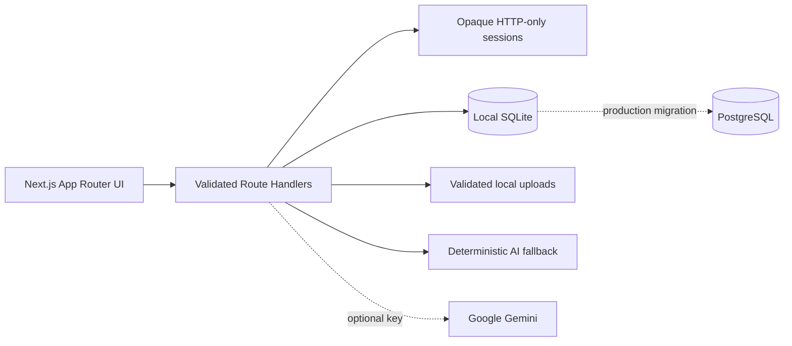

# Alkebulan Flow

**AI Operations Hub for Service Businesses**

Alkebulan Flow is a portfolio-grade operations workspace for small agencies, contractors, consultants, and freelancers. It brings clients, projects, tasks, files, deadlines, activity, and AI-assisted updates into one calm dashboard.

## Current status

The local core MVP is implemented and verified: relational SQLite persistence, secure credential auth, workspace roles, server-backed task workflows, validated client/project APIs, safe local uploads, and optional Gemini generation with deterministic fallback. Production PostgreSQL, hosted reset email, and object storage remain deployment-stage replacements.

## Quick start

```bash
npm install
npm run dev
```

Open `http://localhost:3000`. Protected routes redirect to `/login`; use the seeded demo account below. If port 3000 is taken, Next.js picks the next free port—the live URL is printed in the server log.

```text
Demo workspace: demo@alkebulan.local
Demo password:  FlowDemo2026!
```

These are fictional local-only demo credentials, not contact information or production secrets.

## Architecture



- Next.js 16 App Router, React 19, TypeScript
- Tailwind CSS 4 with owned shadcn-style primitives and Radix foundations
- Recharts for responsive analytics
- Zod contracts for structured AI output
- Vercel AI SDK with optional Google Gemini provider
- Better SQLite3 with normalized relational schema and foreign keys
- Node scrypt password hashing and opaque database-backed sessions
- Vitest for deterministic logic tests

## Roadmap and progress ledger

Checkboxes are marked complete only after implementation and verification.

### 1. Scope and foundation

- [x] Select a credential-free, locally runnable portfolio architecture
- [x] Initialize Next.js, TypeScript, Tailwind, Git, and dependency lockfile
- [x] Establish Alkebulan visual tokens and product positioning
- [x] Create the authoritative README roadmap
- [x] Commit the initial staged history

### 2. Design system and demo experience

- [x] Responsive navigation shell with mobile drawer
- [x] Dashboard information architecture and branded workspace chrome
- [x] Reusable Button, Card, Badge, Input, and avatar patterns
- [x] Light and dark color themes with toggles on the login page and in the dashboard header
- [x] Workspace search over projects, clients, tasks, and files with a navigable results dropdown
- [x] Accessible labels, focus states, and semantic navigation
- [x] Contact-free demo mode indicator and fictional account
- [x] Verify representative desktop and mobile layouts in a browser

### 3. Data, authentication, and core workflows

- [x] Typed client, project, task, activity, priority, status, and role models
- [x] Seeded demo clients, projects, tasks, and activity
- [x] Secure sign-up, login, logout, and protected routes
- [x] Scrypt password hashing and revocable opaque sessions
- [x] Safe development password reset with one-time expiring tokens
- [x] Owner/Admin/Team roles with server-side authorization
- [x] Client portfolio and project progress views
- [x] Interactive Kanban board with cross-column task movement
- [x] New-task workflow with validation
- [x] Credential-free relational SQLite adapter and automatic seed
- [x] Persistent client/project/task CRUD route handlers
- [ ] Production PostgreSQL migration and hosted reset-email delivery

### 4. Operations and AI

- [x] KPI cards, project-health signals, and responsive revenue chart
- [x] Deadline visibility and unified activity feed
- [x] File library and validated local upload handling
- [x] Notification popover and attention signals
- [x] Structured AI project brief contract
- [x] Project summaries, risks, next actions, and client-update drafting
- [x] Floating Flow AI chatbot available from every page
- [x] Deterministic no-key AI fallback served from a route handler
- [x] Optional credential-backed Gemini structured generation
- [x] Local file metadata persistence with size/type enforcement
- [ ] Production durable object storage and content-signature scanning
- [x] Persistent notification read state with outside-click dismissal
- [x] Dark-mode readability sweep: theme-aware badges, links, avatars, and charts in both modes

### 5. Quality and release confidence

- [x] Lint clean
- [x] Typecheck clean
- [x] Unit tests passing
- [x] Production build passing
- [x] Browser smoke test: dashboard, views, task creation, Kanban, AI brief
- [x] Responsive verification at mobile and desktop widths
- [ ] Automated accessibility scan
- [x] Keyboard-flow review
- [x] Local security review for auth, uploads, authorization, and AI inputs

### 6. Portfolio and deployment package

- [ ] Contact-free polished screenshots
- [x] Short walkthrough script and recording plan
- [x] Architecture diagram
- [x] Setup, test, and implementation documentation
- [x] Environment-variable template
- [x] Vercel deployment instructions and production data checklist
- [ ] Live deployment (requires explicit authorization)

### Stretch features

- [ ] Real-time collaboration
- [ ] Stripe subscriptions
- [ ] Email delivery
- [ ] PDF/CSV export
- [ ] Audit log
- [x] Dark mode with a header toggle, system-preference detection, localStorage persistence, and a no-flash init script

## Commands

| Command | Purpose |
|---|---|
| `npm run dev` | Start the development server |
| `npm run lint` | Run ESLint |
| `npm run typecheck` | Run TypeScript without emitting files |
| `npm test` | Run deterministic unit tests |
| `npm run build` | Create a production build |

## Theming

The interface ships in light and dark. On first visit the theme follows the operating system (`prefers-color-scheme`); the sun/moon toggle overrides it—top right on the login page, in the dashboard header—and the choice persists in `localStorage` under `alkebulan-theme`. A tiny inline script in `src/app/layout.tsx` applies the class before hydration, so there is no flash of the wrong theme; `<html>` carries `suppressHydrationWarning` because that intentional pre-hydration mutation otherwise trips React's hydration check. All components read semantic tokens (`--background`, `--card`, `--muted`, `--primary`, …) defined in `src/app/globals.css`, including chart colors (`--chart-line`, `--chart-fill`) so the revenue chart flips with the theme; status badges, nav states, and avatars use explicit dark variants. Dark mode also sets `color-scheme: dark` so native controls and scrollbars match. Both modes were contrast-checked against WCAG AA/AAA with computed-style measurements.

## Workspace search

The header search indexes live workspace data—projects (by name), clients (by company and industry), tasks (by title), and uploaded files. Results appear in a dropdown capped at eight entries with kind badges and context, a result count or a no-match line, and are ranked in project, client, task, file order. Picking a result switches to the matching view and clears the query; Escape clears, clicking outside closes. Search reflects what currently exists—the activity feed shows historical events for tasks that may have been deleted, so it is not a search source.

## Local data, migration, and seed

The first server request creates `data/alkebulan-flow.sqlite`, applies the idempotent schema, and inserts the fictional demo workspace. Runtime data and file bytes are gitignored. To reset locally, stop the server and remove the SQLite file and `data/uploads` directory, then restart. This intentionally destructive reset is never run automatically.

The schema covers users, workspaces, memberships, clients, projects, tasks, activities, notifications, uploaded-file metadata, sessions, and one-time reset tokens. For PostgreSQL, preserve UUID identifiers, convert timestamps to `timestamptz`, retain foreign keys/check constraints, and replace synchronous SQLite transactions with the selected PostgreSQL adapter.

## Authentication and roles

- Passwords use Node `scrypt` with a unique 128-bit salt.
- Sessions are 256-bit opaque tokens; only SHA-256 token hashes are stored.
- Cookies are HTTP-only, `SameSite=Strict`, path-scoped, and secure in production.
- Mutation routes check same-origin requests and validate payloads with Zod.
- Owner: full workspace, deletion, and membership management.
- Admin: client/project/task management without owner-only destructive controls.
- Team: workspace read access and task management only.
- Reset requests do not reveal account existence. Development tokens appear only outside production, expire after 15 minutes, are single-use, and revoke existing sessions after a password change.

## Optional Gemini configuration

Copy `.env.example` to `.env.local` and set `GOOGLE_GENERATIVE_AI_API_KEY` locally. Never commit the key. With no key—or if Gemini fails—the validated deterministic brief is returned, and the failure reason is logged server-side. No external AI call is required for development or tests.

The default model is `gemini-3.6-flash`, overridable with `GEMINI_MODEL` in `.env.local`. Earlier flash models are retired for new Google AI Studio accounts, so an outdated model name silently degrades every request to the fallback; if replies feel canned, check the server log for `[ai/chat]` errors and confirm the model is one your key can use.

## Continuation manual

### What is implemented

- A global bottom-right Flow AI widget appears on login and protected workspace pages.
- Anonymous users receive local demo guidance; workspace questions require authentication.
- The client keeps at most 12 displayed messages and sends at most 8 recent messages to the server.
- `POST /api/ai/chat` validates messages, rate-limits each signed-in user, injects concise project/task context server-side, and caps the Gemini instruction at short operations-focused replies.
- The Gemini key is read only on the server. The browser bundle and API response never contain it.
- Missing or failed Gemini requests return a deterministic workspace-priority answer.

### Configure and run safely

1. Copy `.env.example` to `.env.local`.
2. Put the Gemini key after `GOOGLE_GENERATIVE_AI_API_KEY=` in `.env.local` only.
3. Keep `.env.local` ignored and verify with `git check-ignore .env.local`.
4. Run `npm run dev`, sign in, and open the round Flow AI button at the bottom right.
5. For a no-network fallback check, temporarily leave the key blank, restart the server, and ask “What needs attention?”
6. Run `npm run lint`, `npm run typecheck`, `npm test`, and `npm run build` before committing.

### Known limitations

- Chat history is intentionally in-memory in the current browser tab and is not persisted.
- The fallback is deterministic and prioritizes high-priority open tasks; it is not a general language model.
- Local rate limiting is per process; hosted multi-instance deployment needs a distributed limiter.
- SQLite and local uploads are for a single local instance, not Vercel serverless storage.
- Gemini is optional and its free-tier availability, model access, and quotas depend on the user’s Google account.

### Recommended next steps

1. Add production PostgreSQL and object-storage adapters behind the current repository interfaces.
2. Add hosted reset-email delivery and distributed rate limiting.
3. Add an automated accessibility scan, then capture the five portfolio screenshots listed in `docs/PORTFOLIO.md`.
4. Deploy only after replacing local persistence and reviewing environment variables in the hosting dashboard.
5. Consider remaining stretch work—realtime, billing, exports, and audit log—only after the hosted core passes the same gates. Dark mode is already shipped.

## Latest verification — 2026-09-14

- `npm run lint` — passed with 0 errors and 0 warnings
- `npm run typecheck` — passed
- `npm test` — 5 files, 20 tests passed, covering auth, role enforcement, client/project/task CRUD, AI protection, uploads, and persistence
- `npm run build` — passed; 19 application/API routes generated successfully
- Browser — desktop and 390×844 protected layouts rendered without console warnings/errors; the floating chat remained available on both `/app` and `/login`
- End-to-end — authenticated, confirmed persisted operations data, received the offline workspace-priority chat response, logged out, and confirmed the global chat entry point remained visible
- Security — the final secret audit confirmed the key is present only in ignored `.env.local`, absent from tracked files, and absent from Git history

## Session additions — 2026-09-14 (post-MVP)

- **Gemini repair** — the configured `gemini-2.5-flash` model was retired for new Google AI Studio keys, so every request failed silently into the deterministic fallback; default moved to `gemini-3.6-flash`, fallback catches now log the provider error server-side, and live Gemini replies were verified end-to-end in the browser
- **Workspace search** — header search previously rendered a decorative input with no handlers; it now searches projects, clients, tasks, and files with a navigable dropdown, verified across hit, navigation, and no-match cases
- **Notifications** — added outside-click dismissal; read-state persistence via `PATCH /api/notifications` and SQLite `read_at` re-verified across reload
- **Dark mode** — new: theme toggles on login and dashboard, `prefers-color-scheme` default, persisted choice, no-flash init script, `suppressHydrationWarning` to keep hydration clean, theme-aware chart tokens, and a full dark-readability sweep (inputs, badges, links, avatars, nav, promo cards) with measured contrast of 7.1:1+ in light and 9.8:1+ in dark on primary actions
- **Completed interaction audit** — New client now posts through the API; client menus provide Edit/Delete; task cards open a full editor with status, priority, assignee, and due-date controls; images/PDFs preview in-app while every uploaded file exposes Download and confirmed Delete
- **Activity integrity** — client create/update/delete, task create/update/delete, and file upload/delete are persisted with the signed-in actor and reflected immediately in the Activity view
- **File retrieval security** — authenticated workspace-scoped file serving uses exact stored metadata, inline preview only for images/PDFs, attachment delivery for other types, no-sniff headers, and owner/admin deletion
- **Quality gates re-run after all changes** — lint clean, typecheck clean, 20/20 tests passing, production build passing

## AI behavior

`POST /api/ai/brief` returns a Zod-compatible summary, risk list, next actions, and client-update draft. If `GOOGLE_GENERATIVE_AI_API_KEY` is configured, the Vercel AI SDK requests structured output from Gemini. Otherwise—or on provider failure—the route returns the local deterministic fallback contract.

## Deployment notes

SQLite and local uploads are intended for a single-instance local demo, not serverless persistence. Before production use, connect PostgreSQL, replace local file writes with object storage, add distributed rate limiting, configure reset-email delivery, and set the Gemini key only if desired. No paid service, external AI call, or deployment has been created.

## Privacy

All visible organizations and people are fictional. The public demo must not display email addresses, phone numbers, social handles, or other direct contact information. The `.local` login identifier exists only as non-routable sample data.
